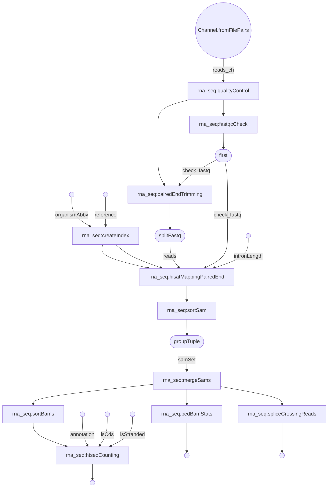

# 
Bulk RNA-Seq analysis

This nextflow graph is for the QC, mapping and read counting of bulk RNA-Seq. 

***
Nextflow workflow
*** 

```mermaid
flowchart TD
    p0((Channel.fromFilePairs))
    p1(( ))
    p2(( ))
    p3[rna_seq:createIndex]
    p4[rna_seq:qualityControl]
    p5[rna_seq:fastqcCheck]
    p6([first])
    p7[rna_seq:pairedEndTrimming]
    p10([splitFastq])
    p11(( ))
    p12[rna_seq:hisatMappingPairedEnd]
    p13[rna_seq:sortSam]
    p14([groupTuple])
    p15[rna_seq:mergeSams]
    p17[rna_seq:sortBams]
    p18(( ))
    p19(( ))
    p20(( ))
    p21[rna_seq:htseqCounting]
    p22(( ))
    p23[rna_seq:bedBamStats]
    p24(( ))
    p25[rna_seq:spliceCrossingReads]
    p26(( ))
    p0 -->|reads_ch| p4
    p1 -->|organismAbbv| p3
    p2 -->|reference| p3
    p3 --> p12
    p3 --> p12
    p4 --> p5
    p4 --> p7
    p5 --> p6
    p6 -->|check_fastq| p7
    p7 --> p10
    p10 -->|reads| p12
    p6 -->|check_fastq| p12
    p11 -->|intronLength| p12
    p12 --> p13
    p13 --> p14
    p14 -->|samSet| p15
    p15 --> p17
    p17 --> p21
    p18 -->|annotation| p21
    p19 -->|isCds| p21
    p20 -->|isStranded| p21
    p21 --> p22
    p15 --> p23
    p23 --> p24
    p15 --> p25
    p25 --> p26
```
